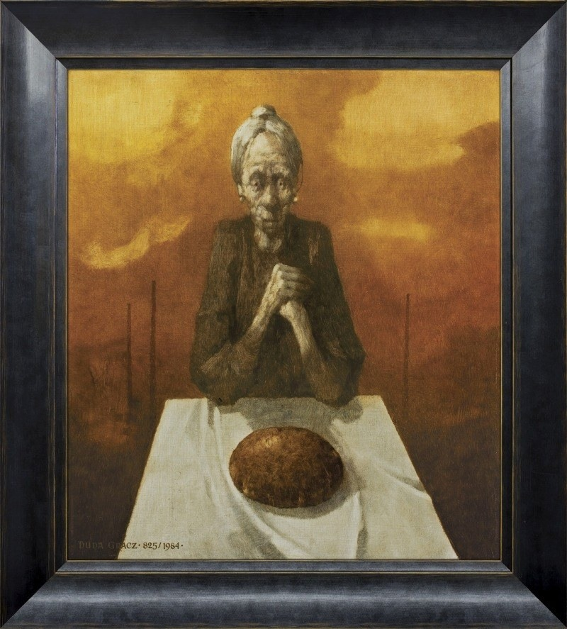
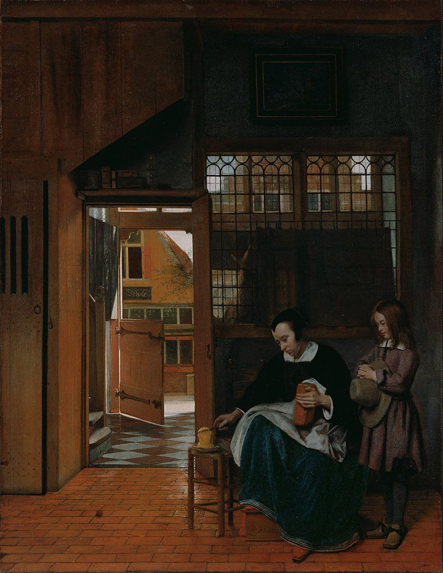
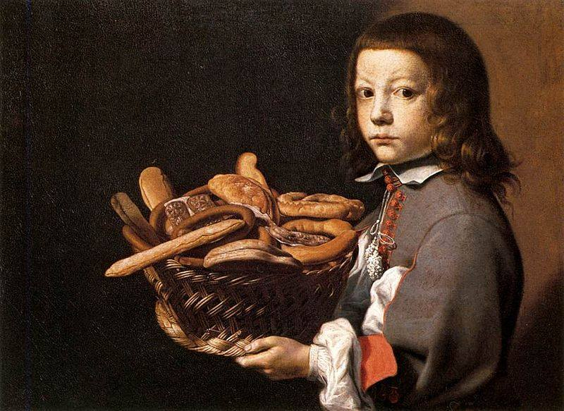

# Czym jest chleb?

Chleb to pieczywo otrzymywane z wypieku ciasta, będącego jednorodnym połączczeniem mąki zbożowej różnego gatunku i wody, poddanego najczęściej, ale nie zawsze, fermentacji alkoholowej (z wykorzystaniem drożdży), wyrobionego w bochny różnego kształtu i wielkości.

# Historia chleba

### Starożytność

Ludzie wypiekają i jedzą chleb już od 12 tysięcy lat. Prawdopodobnie pierwszym chlebem było pieczywo zbożowe w postaci ugotowanej pasty, która była mieszanką różnych zbóż. **Najstarszy chleb jaki udało się odnaleźć archeologom pochodzi z Krety, a jego wiek określa się na 6100 lat.**
Początkowo bochenki były płaskie i twarde. W dzisiejszych czasach uznano by zapewne, że nie nadają się do jedzenia.Dopiero Egipcjanie około 2600 lat p.n.e. wpadli na to, w jaki sposób uczynić chleb pulchnym. To oni ponad 4000 lat temu po raz pierwszy upiekli chleb na zakwasie. Jest wiele opowieści na temat powstania zakwasu. Jedna z nich mówi, że pewna niewolnica zapomniała o papce zbożowej pozostawionej na słońcu. Miała z niej upiec placki dla swojego pana. Kiedy okazało się, że owa papka zaczęła fermentować, wystraszyła się, że zostanie ukarana za zmarnowanie ciasta. Postanowiła więc mimo to upiec placki. I okazało się, że były bardziej pulchne i smaczniejsze niż poprzednie. 

### Średniowiecz 
Archaiczną formę chleba wśród Słowian, która przeznaczona była do codziennego spożycia stanowił placek chlebowy zwany podpłomykiem noszący również w języku staropolskim nazwę wychopieniek[6]. Formą pieczywa odświętnego był kołacz stanowiący istotny element wesel i innych świąt. W okresie późniejszym, średniowieczną sztukę piekarską rozwijano w klasztorach i rzemieślniczych (cechowych) piekarniach miejskich.

### Wynalezienie chleba krojonego
**Otto Frederick Rohwedder**  uważany jest powszechnie za wynalazcę przemysłowego chleba porcjowanego. W 1912 r. Rohwedder opatentował maszynę do automatycznego krojenia chleba, jednak problemy z utrzymaniem świeżości takiego pieczywa zniechęciły go do uruchomienia produkcji na większą skalę. Dopiero w 1928 r., po emigracji do USA, Rohwedder wrócił do swojego wcześniejszego pomysłu, projektując linię produkcyjną, która najpierw kroiła, a następnie natychmiast szczelnie pakowała pokrojony chleb. Maszyna ta została zainstalowana i uruchomiona po raz pierwszy przez przedsiębiorstwo Chillicothe Baking Company w piekarni w Chillicothe, Missouri (USA). **Pierwsze kromki powstały 7 lipca tego samego roku.**

# Przepis na *chleb graham na drożdżach*

### Składniki

#### Składniki na zaczyn
- 10 g świeżych drożdży
- pół łyżeczki  cukru
- 40 g letniej wody
- 1 łyżka mąki pszennej typ 480 lub 550


#### Składniki na ciasto właściwe
- 50 g mąki żytniej razowej typ 2000
- 200 g maki pszennej graham lub pszennej razowej typ 1850
- 250 g mąki pszennej tortowej typ 450 lub luksusowej typ 550
- 30 g roztopionego masła
- 2 płaskie łyżeczki soli
- 1 łyżeczka płynnego miodu
- 300 g letniej wody
- cały zaczyn

### Przygotowanie

1. przygotować rozczyn z drożdży – drożdże pokruszyć w miseczce, zasypać cukrem, dodać letnią wodę oraz łyżkę mąki. Całość wymieszać i pozostawić przykryte do wyrośnięcia na kilka minut. Drożdże powinny wyraźnie urosnąć.
2. w dużej misce połączyć wszystkie rodzaje mąki z solą, miodem i stopionym masłem. Dodać wyrośnięte drożdże oraz letnią wodę.
3. Wyrobić gęste i gładkie ciasto. Gdyby ciasto było zbyt kleiste można dodać jeszcze odrobinę mąki, ale nie za dużo – tylko tyle aby można było z ciasta uformować kulę.
4. Ciasto przełożyć do miski wysmarowanej olejem, przykryć szczelnie folią spożywczą i pozostawić w ciepłym miejscu do wyrośnięcia na ok. 1 godzinę – lub do czasu gdy ciasto nawet potroi swoją objętość.
5. Wyrośnięte ciasto przełożyć na blat (można blat delikatnie posmarować oliwą, by ciasto się nie przyklejało), rozpłaszczyć i usunąć z ciasta pęcherzyki powietrza. Następnie uformować z ciasta podłużny bochenek i przełożyć go do formy o wymiarach 30 cm x 10 cm, wysmarowanej np. olejem i wysypanej otrębami żytnimi. Formę przykryć folią spożywczą i całość pozostawić do wyrośnięcia na ok. 20 minut – ciasto powinno wyrosnąć do brzegów formy.

### Pieczenie

1. Piekarnik nagrzać do temperatury 200 stopni C, program „góra + dół”.
2. Wyrośnięty chleb wstawić do nagrzanego piekarnika i piec ok. 50min – 1 godziny.
3. Gdyby skórka chleba zbyt szybko się zarumieniła – należy formę przykryć folią aluminiową i dalej piec. Chleb pod koniec pieczenia można wyciągnąć z formy i dopiec go już bez foremki, aż postukany od spodu będzie wydawał głuchy odgłos.

[Tu znajdziesz więcej przepisów](http://przepisnachleb.pl/)

# Jaki gatunek chleba powinieneś spożywać? 


| Gatunek chleba | Dolegliwości |
| -------------- | -------------|
| pszenny  | problemy trawienne i wrzody żołądka |
| pszenno-żytni |kłopoty z trawieniem, potrzeba uzupełnienia cennych składników odżywczych |
| żytni | podwyższony poziom cholesterolu, cukrzyca, dieta odchudzająca |


# Firmy wypiekające chleb w Gdańsku

`Nie ma tu wszystkich piekarni, gdyż ten .csv tworzony jest przeze mnie i nie chciało mi się tyle przepisywać z trojmiasto.pl`
###

```{r}
library(tidyverse)
library(readr)
piekarnie_arkusz1 <- read_csv("piekarnie_arkusz1.csv")
View(piekarnie_arkusz1)
```

### Najstarsze piekarnie

```{r echo = TRUE}
filter(piekarnie_arkusz1, pieczywo == 1, miasto == "gdańsk") %>%
  select(nazwa, lokale, rok) %>%
  arrange(rok)

```

### Piekarnie posiadające więcej niż 5 lokali, założone po 1995 roku

```{r}
filter(piekarnie_arkusz1, rok > 1995 & lokale > 5) %>%
select(nazwa, rok, lokale) %>%
arrange(desc(rok))

```

### Ilość lokali piekarni, które nie zostały założone w Gdańsku

```{r}
filter(piekarnie_arkusz1, miasto != "gdańsk", lokale > 5) %>%
select(nazwa, rok, lokale) %>%
arrange(desc(lokale))
```

### Ilość cukierni w kilku miastach woj. pomorskiego

```{r}
ggplot(data = piekarnie_arkusz1) +
geom_col(mapping = aes(x= miasto, y = lokale, fill = "lokale"))+
labs(title= "Ilość lokali w miastach", x= "Miasto", y= "Ilość lokali") +
theme_classic(10)
```


# Chleb w kulturze

## Chleb w tradycji ludowej
W kulturze ludowej chleb był nie tylko symbolem pożywienia, ale także dostatku i pomyślności. Nie dla wszystkich był on podstawą wyżywienia – jeszcze w I połowie XX wieku w wielu domach pojawiał się tylko podczas większych świąt. Chleba nie można było marnować, dopuścić do jego zepsucia – mogło by to spowodować gniew Boży. Przed krojeniem należało uczynić na bochenku znak krzyża Szacunek dla chleba jest do dziś nieodłącznym elementem naszego dziedzictwa kulturowego.Proces wypieku chleba był bardzo zrytualizowany. Należało uważać, ponieważ chleb można było bardzo łatwo zauroczyć. Do wypieku chleba niezbędna była dzieża (wykonana z dębowych desek, najlepiej z drzewa rażonego piorunem),  z którą związanych było wiele praktyk o magicznym charakterze. Dzieża pełniła istotną rolę w czasie wesela – podczas oczepin w momencie zamiany wianka na czepiec panna młoda siadała na dzieży, która utożsamiana była z płodnością i życiem (to w niej rosło ciasto na chleb). Dzieża symbolizowała zatem trudny do określenia potencjał twórczy.

## Motyw chleba w poezji
<p>
</p>

**Julian Tuwim** *Krwawy chleb*

<p> Wzrośnie wam z tłustej ziemi niebywałe zboże: </p>
<p>Ciężkie, ogromne kłosy, napęczniałe ziarna, </p>
<p>Cuda się będą działy w pulchnej ziemnej korze, </p>
<p>Za ziarno każde - korzec da wam gleba czarna. </p>

<p>Zbierzcie plon zasobny na długich lat wiele, </p>
<p>Wymłócicie cepami dary płodnej gleby, </p>
<p>Ponapełniacie worki, młynarz ziarno zmiele, </p>
<p>Matka mąkę zamiesi - i upiecze chleby. </p>

<p>I przy dymiącej misce siądźcie z słowem Bożem. </p> 
<p>Ojciec krzyżem przeżegna bochen wypieczony, </p>
<p>Lecz gdy go krajać zacznie poszczerbionym nożem, </p>
<p>Tryśnie z chleba waszego strumień krwi czerwony. </p>


---

**Cyprian Kamil Norwid** *Moja piosenka*

<p>Do kraju tego, gdzie kruszynę chleba </p>
<p>Podnoszą z ziemi przez uszanowanie </p>
<p>Dla darów Nieba.... </p>
<p>Tęskno mi, Panie... </p>

<p>Do kraju tego, gdzie winą jest dużą </p>
<p>Popsować gniazdo na gruszy bocianie, </p>
<p>Bo wszystkim służą... </p>
<p>Tęskno mi, Panie... </p>

<p>Do kraju tego, gdzie pierwsze ukłony </p>
<p>Są, jak odwieczne Chrystusa wyznanie, </p>
<p>"Bądź pochwalony!" </p>
<p>Tęskno mi, Panie... </p>

<p>Tęskno mi jeszcze i do rzeczy innej, </p> 
<p>Której już nie wiem, gdzie leży mieszkanie, </p>
<p>Równie niewinnej... </p>
<p>Tęskno mi, Panie... </p>

<p>Do bez-tęsknoty i do bez-myślenia, </p>
<p>Do tych, co mają tak za tak - nie za nie, </p>
<p>Bez światło-cienia... </p>
<p>Tęskno mi, Panie... </p>

<p>Tęskno mi owdzie, gdzie któż o mnie stoi? </p>
<p>I tak być musi, choć się tak nie stanie </p>
<p>Przyjaźni mojej... </p>
<p>Tęskno mi, Panie... </p>


## Motyw chleba w muzyce

[sprawdź](https://www.youtube.com/watch?v=YC-pDKWLRKw)

## Motyw chleba w malarstwie

#### Jerzy Duda- Gracz



---

#### Elvaristo Baschenis



---

#### Pieter de Hooch


 
---


## Wykorzystywanie chleba podczas spędzania wolnego czasu

* Wspólne biesiadowanie
* Dokarmianie ptactwa (np. kaczek, gołębi) podczas spacerów
* Preferowany przez niektórych wędkarzy jako przynęta


